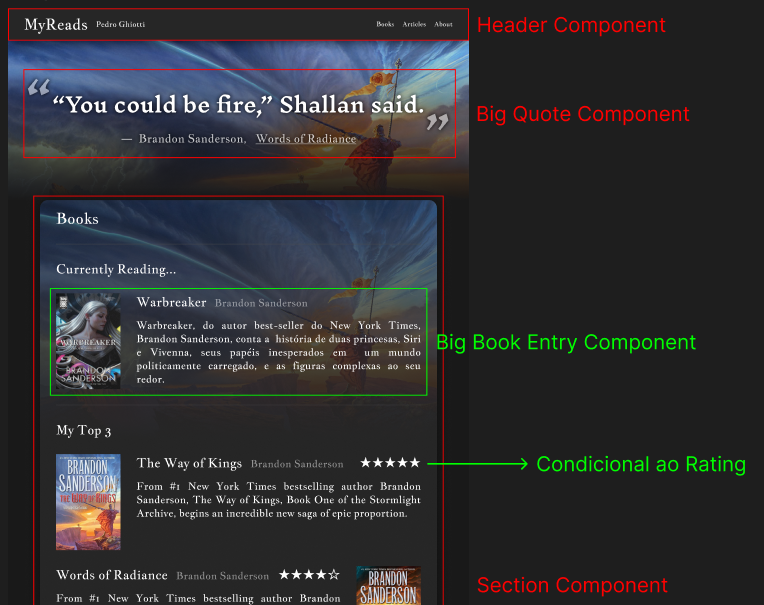
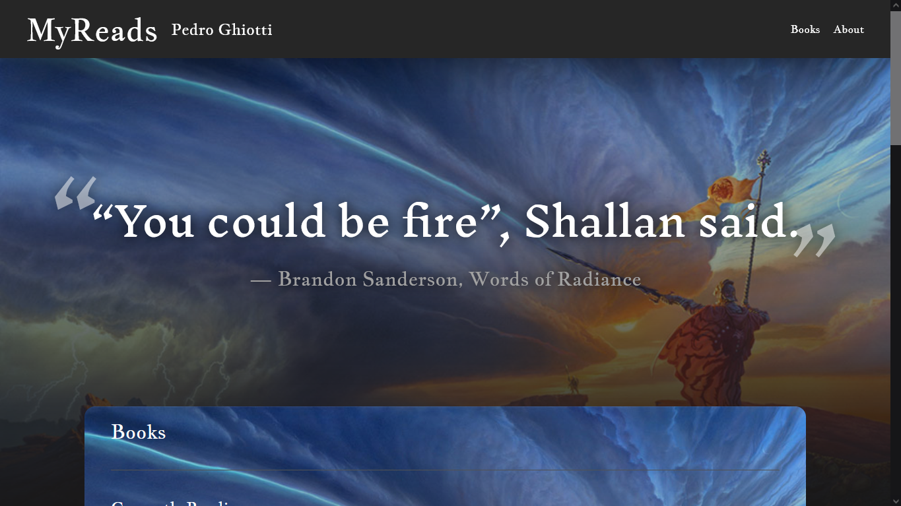
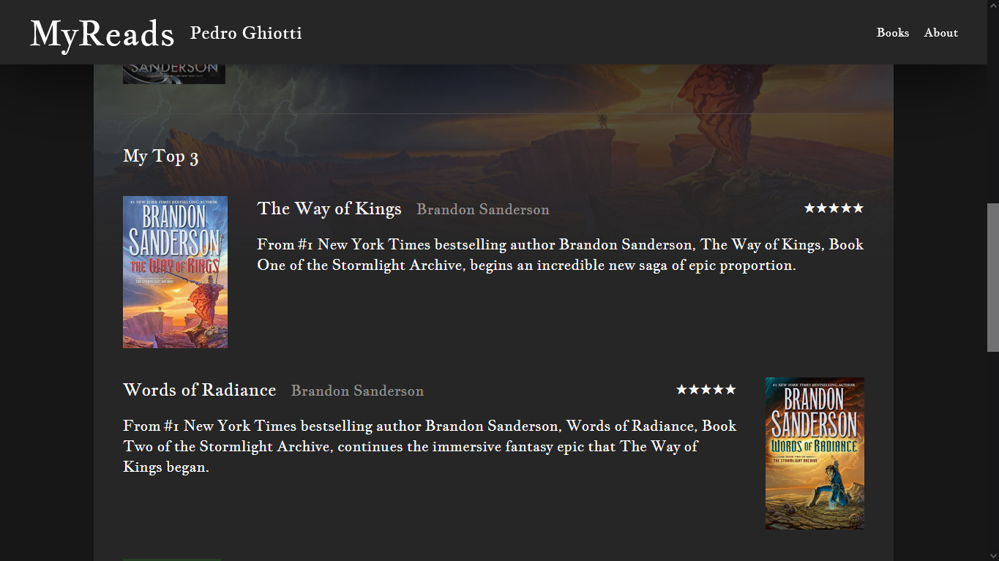
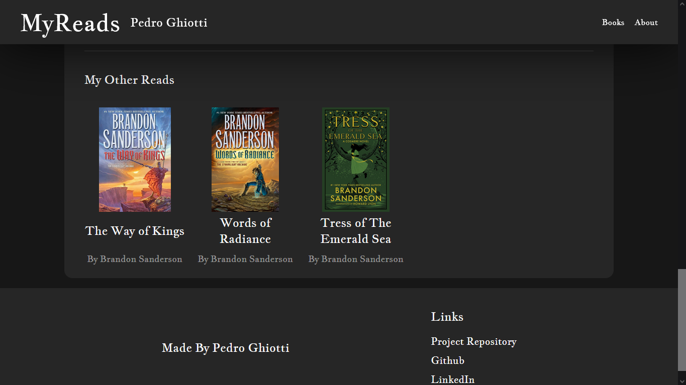

# Desafio de Projeto 'Criando um Blog com Angular'

## Setup
O projeto base foi gerado com a Angular CLI, utilizando o comando `ng new`.
Gerado  o projeto, foi foi adicionada a dependência do TailwindCSS seguindo a [documentação do projeto](https://tailwindcss.com/docs/installation/framework-guides/angular).

## Planejamento
Seguindo o conceito de blog apresentado, tive a ideia de desenvolver uma pequena página inicial de um blog pessoal sobre leituras. A ideia é como uma página de perfil de um goodreads mas só minha.
Para desenvolver o design, encontrei inspiração no próprio [goodreads](https://www.goodreads.com/) e em um blog interessante do desenvolvedor de software [Thomas Queste](https://www.tomsquest.com/).
O design em si foi montado no software Figma e pode ser visto, por completo, [clicando aqui](https://www.figma.com/design/SpcEBQjQOufytiuTOyiwzW/Angular-Blog---MyReads?node-id=0-1&t=QwjVlc7kHgCwT6mk-1).

## Resultado
O resultado, embora não tenha imitado perfeitamente o design, foi satisfatório. Embora algumas coisas ainda faltem como melhor responsividade e adição de maior variedade de dados (dados são hardcoded, fornecidos pelo service FakeBooksService), finalizo o projeto aqui.
Foi bastante difícil desenvolver o projeto, visto que o Front-End é um pouquinho fora da minha zona de conforto E decidi testar pela primeira vez o Tailwind CSS ao mesmo tempo, mas é uma prática valiosa. O próximo vai ser mais fácil! (Ou mais complicado mas dev tem que gostar de desafio.)
Tudo isso dito, segue o resultado final:

## Como Rodar o Projeto
Basta clonar o repositório e, com um terminal aberto em sua pasta, executar: `npm install` e, então `ng serve`. 

## Referências
- [Angular - Documentação](https://angular.dev/overview)
- [Tailwind CSS - Documentação](https://tailwindcss.com/docs/installation/framework-guides/angular)
