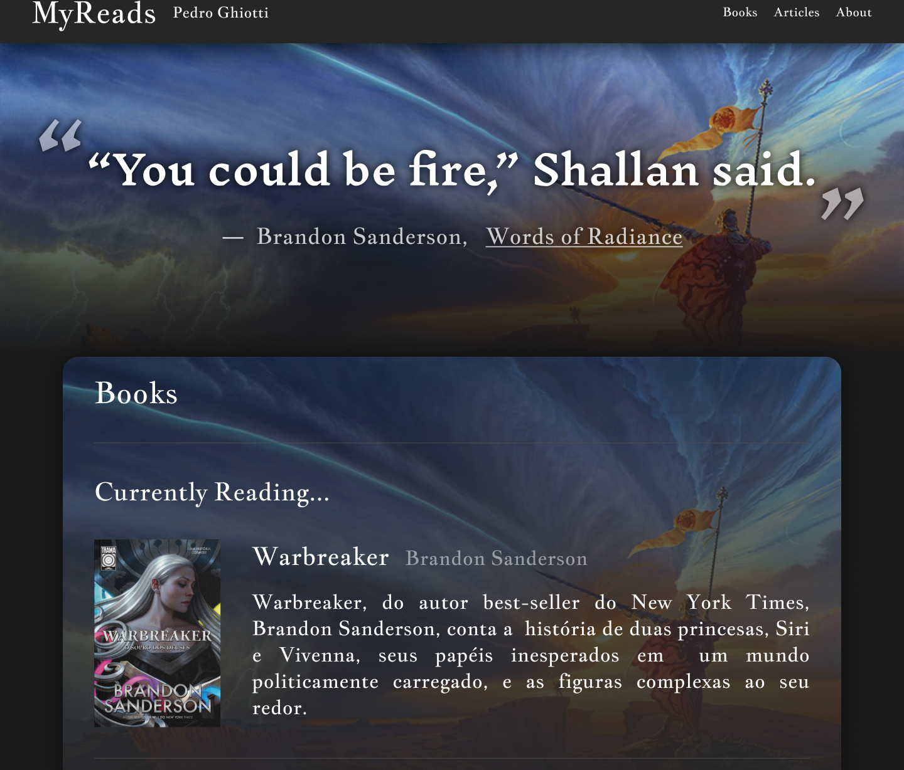

# Desafio de Projeto 'Criando um Blog com Angular'

## Setup
O projeto base foi gerado com a Angular CLI, utilizando o comando `ng new`.
Gerado  o projeto, foi foi adicionada a dependência do TailwindCSS seguindo a [documentação do projeto](https://tailwindcss.com/docs/installation/framework-guides/angular).

## Planejamento
Seguindo o conceito de blog apresentado, tive a ideia de desenvolver uma pequena página inicial de um blog pessoal sobre leituras. A ideia é como uma página de perfil de um goodreads mas só minha.
Para desenvolver o design, encontrei inspiração no próprio [goodreads](https://www.goodreads.com/) e em um blog interessante do desenvolvedor de software [Thomas Queste](https://www.tomsquest.com/).
O design em si foi montado no software Figma e pode ser visto, por completo, [clicando aqui](https://www.figma.com/design/SpcEBQjQOufytiuTOyiwzW/Angular-Blog---MyReads?node-id=0-1&t=QwjVlc7kHgCwT6mk-1).

 
